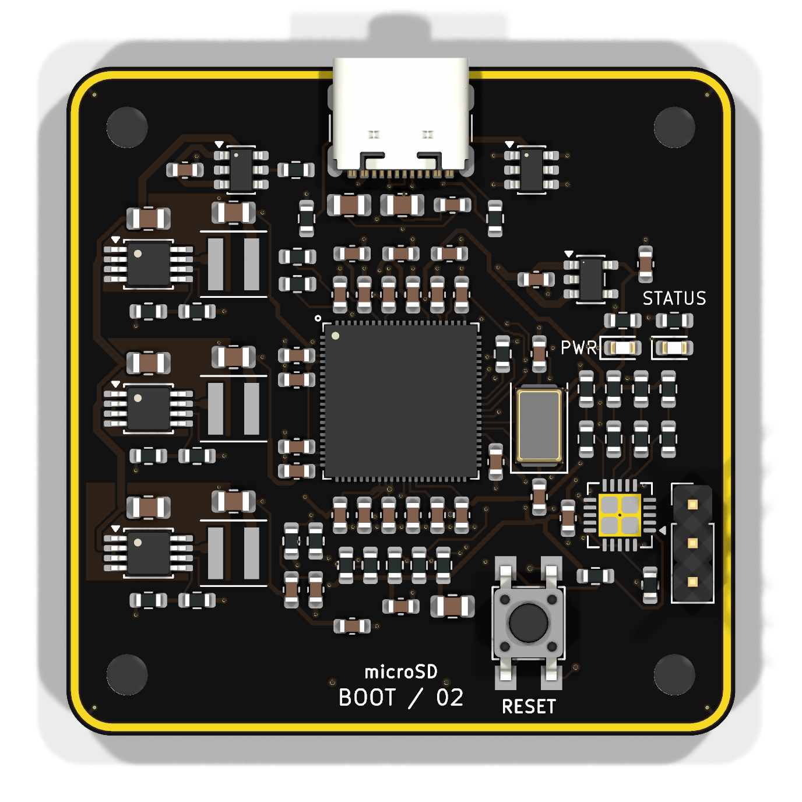

# my-first-linux-board

`my-first-linux-board` is a small F1C200S Linux board built around removable microSD storage, USB-C power and USB device data, a 3.3 V UART console, and power/status LEDs. This repository contains the exact KiCad design used for the assembled board, the working Buildroot firmware source, the final JLCPCB fabrication package, and purchasing files.

The assembled board boots U-Boot 2026.01 and Linux 6.19.14 into a minimal BusyBox system. Both boot stages identify it as `Clark's Board`.



## Hardware

| Item | Final design |
|---|---|
| Processor | Allwinner F1C200S with 64 MiB integrated DDR1 |
| Board | 44 × 44 mm, four copper layers, R3 rounded corners |
| Power input | USB-C, 5 V, TPS2553 current-limited input switch |
| Rails | Three TPS62160 bucks for core, DDR, and I/O; TLV75528 analog LDO |
| Storage | Bottom-mounted microSD socket |
| Console | UART0 on a three-pin 3.3 V header: GND, TX, RX |
| USB | Native USB peripheral connection over USB-C |
| Indicators | Fixed power LED and PC0-controlled active-low status LED |
| Assembly | Components on top except the bottom microSD socket; through-hole UART header |
| Finish used | Black solder mask, white silkscreen, ENIG |

Open [hardware/boot-console.kicad_pro](hardware/boot-console.kicad_pro) in KiCad 10. The [BOM](hardware/docs/BOM.md), [pinout](hardware/docs/PINOUT.md), and [component-purpose guide](hardware/docs/COMPONENT-PURPOSE.md) describe the final circuit.

The [schematic PDF](docs/schematic.pdf) and [combined copper-layer image](docs/images/all-copper-layers.png) are convenient read-only views of the same final design.

## Firmware

The firmware directory is a Buildroot external tree. On macOS or another Docker host:

```sh
cd firmware
./build-container.sh
```

The complete card image is generated at:

```text
firmware/output/images/sdcard.img
```

The proven board configuration uses one-bit microSD transfers at 12.5 MHz. The physical board has four data traces, but Linux produced data errors in four-bit/25 MHz mode on the first assembly; the conservative setting boots reliably and is therefore the canonical configuration.

UART0 is 115200 baud, 8 data bits, no parity, and one stop bit. Linux also
creates a composite USB device with a CDC ACM console and a CDC ECM Ethernet
link. The board is `192.168.7.2/24`; its small DHCP server assigns the attached
host an address without advertising a default route or DNS server. On macOS,
the gadget can enumerate before Network Settings creates a service. Find the
interface whose MAC address is `02:00:00:00:07:01`, assign the host side
`192.168.7.1` for immediate access, and ask macOS to detect the new hardware:

```sh
iface=$(for interface in $(ifconfig -l); do
  ifconfig "$interface" | grep -q 'ether 02:00:00:00:07:01' && echo "$interface"
done)
sudo ifconfig "$iface" inet 192.168.7.1 netmask 255.255.255.0 up
sudo networksetup -detectnewhardware
```

This address lasts until the interface is removed or reconfigured. After
`networksetup -detectnewhardware` creates the service, give it the persistent
static address used by this direct link. The service on the tested Mac is named
`Clark's Board Console + Ethernet`:

```sh
sudo networksetup -setmanual "Clark's Board Console + Ethernet" \
  192.168.7.1 255.255.255.0 0.0.0.0
```

If macOS uses a different service name, find it with
`networksetup -listallnetworkservices` and substitute that name. DHCP did not
activate this ECM link reliably, so keep the host address static.

Prometheus metrics are the only HTTP resource. Scrape them with:

```sh
curl http://192.168.7.2/cgi-bin/metrics
```

The endpoint uses the Prometheus 0.0.4 text format and reports board identity,
time, CPU, load, memory, VM, pressure, filesystem, microSD, network, socket,
entropy, LED, service, USB gadget, and available thermal, CPU-frequency, and
watchdog data. The root URL and every other HTTP path intentionally return 404.

SSH is available as `root` with a blank password:

```sh
ssh root@192.168.7.2
```

This passwordless access is intended for a directly attached development
cable. The first boot stores a generated SSH host key on the FAT boot partition
so the host fingerprint remains stable while the read-only root stays unchanged.

The status LED appears at:

```text
/sys/class/leds/boot-console:green:status
```

It uses the CPU `activity` trigger by default. Manual control:

```sh
LED=/sys/class/leds/boot-console:green:status
echo none > "$LED/trigger"
echo 1 > "$LED/brightness"
echo 0 > "$LED/brightness"
```

See [firmware/README.md](firmware/README.md) for build details and [firmware/docs/BRINGUP.md](firmware/docs/BRINGUP.md) for bench bring-up.

## Manufacturing and purchasing

- [fabrication/clarks-board-JLCPCB-gerbers.zip](fabrication/clarks-board-JLCPCB-gerbers.zip) is the exact bare-board package used for the final revision.
- [fabrication/assembly/clarks-board-JLCPCB-BOM.csv](fabrication/assembly/clarks-board-JLCPCB-BOM.csv) and [fabrication/assembly/clarks-board-JLCPCB-CPL.csv](fabrication/assembly/clarks-board-JLCPCB-CPL.csv) are formatted for JLCPCB assembly upload.
- [procurement/DigiKey-order.csv](procurement/DigiKey-order.csv) and [procurement/LCSC-order.csv](procurement/LCSC-order.csv) contain the final supplier split used during sourcing.
- [hardware/assembly/ibom.html](hardware/assembly/ibom.html) is an interactive assembly view.

The fabrication package retains the routed board exactly. USB impedance was not matched to a specific JLCPCB controlled-impedance stackup, so select and verify a stackup before changing USB routing or ordering a controlled-impedance revision.

## Validation status

- The assembled board reaches a Linux login prompt over UART.
- The status LED works through the Linux LED subsystem after correcting duplicate PC0 pin ownership.
- KiCad ERC and DRC pass on the final source.
- The saved fabrication package matches the final KiCad source.
- Power/reset calculations and saved transient results are documented in [docs/POWER-VERIFICATION.md](docs/POWER-VERIFICATION.md).

Generated firmware images, Buildroot downloads, compiler output, KiCad backups, caches, and editor state are intentionally excluded from Git.
