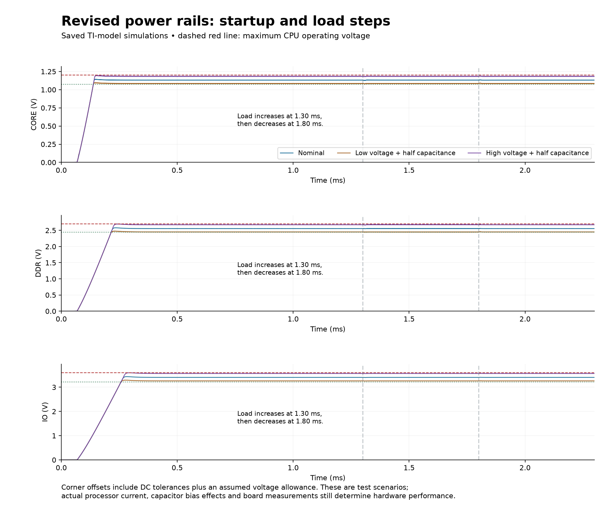
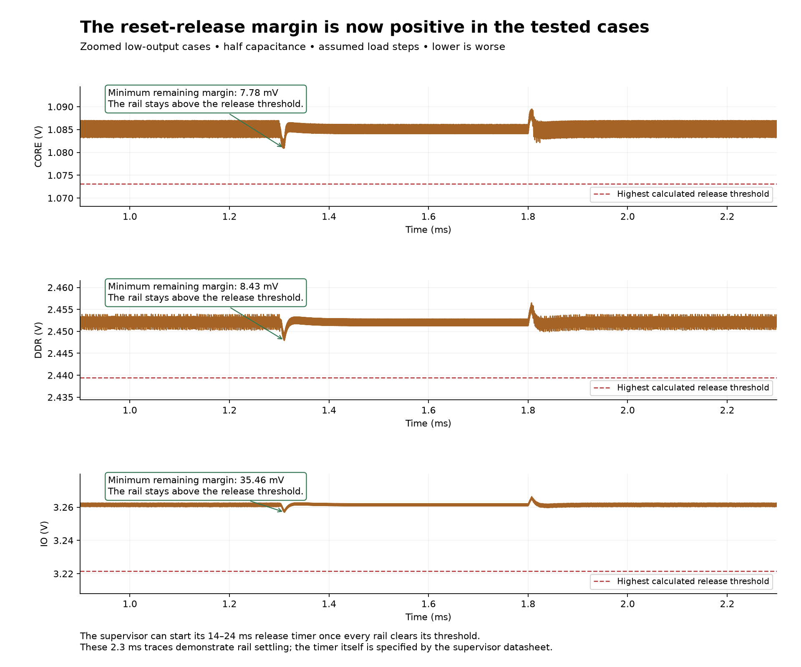

# Power/reset fix verification

The final design in `hardware/` corrects the reset-release tolerance problem. All three buck rails clear the calculated maximum reset-release threshold in the tested low-output cases, and their tested startup peaks remain below the processor operating maxima.

## What changed

| References | Final selection | Reason |
|---|---|---|
| R23 / R24 | 340 Ω / 820 Ω | Core target 1.131707 V; lower divider resistance reduces FB leakage error. |
| R25 / R26 | 1.8 kΩ / 820 Ω | DDR target 2.556098 V with positive reset-release margin. |
| R27 / R28 | 2.67 kΩ / 820 Ω | I/O target 3.404878 V with positive reset-release margin. |
| R24 / R26 / R28 precision | Susumu RG1608N-821-W-T1, ±0.05%, ≤10 ppm/°C | Narrows the worst-case output range enough to retain startup headroom. |
| R23 / R25 / R27 precision | ±0.1%, ≤25 ppm/°C | Explicit ratio-error budget with independent temperature drift. |
| R13 | 67.3 kΩ, ±0.1%, ≤25 ppm/°C | Stocked selection; nominal I/O falling reset threshold is 3.092 V. |
| R17 / R18 precision | 48.7 kΩ / 10 kΩ, ±0.1%, ≤10 ppm/°C | Reduces drift of the DDR reset threshold. |

A feedback input draws a small leakage current. That current creates an unwanted voltage across the divider resistance, approximately `I_leak × R_upper`; reducing the resistance reduces this error. Each revised divider draws about 0.976 mA, exchanging a few milliwatts for less voltage uncertainty.

The bucks, supervisor, 2.8 V LDO, capacitors and USB current limiter are unchanged. U5 DBVT and U7 RGPT are packaging-quantity sourcing suffixes for the existing silicon. Capacitor rating labels now match selected MPNs; nominal capacitances remain unchanged. The `+1V1`, `+2V5` and `+3V3` net names identify voltage classes, while the schematic records the precise targets.

## Calculated corners

Resistor initial tolerance and independent temperature drift are multiplied at the worst endpoint relative to 25°C, covering −40 to +125°C. Feedback top/bottom grades are treated separately. The buck bound includes −3.5%/+4% PSM output accuracy and conservative ±400 nA FB leakage; the supervisor includes 396–404 mV threshold, up to 10 mV rising hysteresis and ±25 nA sense leakage.

An additional **assumed** allowance covers 5 mV of line/load/layout error on core and DDR, and 10 mV on I/O. TI provides typical, rather than guaranteed, separate line/load figures, so these allowances are engineering budgets rather than a guarantee over all hardware conditions.

| Rail | Nominal (V) | Lowest output after allowance (V) | Highest release threshold (V) | DC release margin (mV) | Highest output after allowance (V) |
|---|---:|---:|---:|---:|---:|
| CORE | 1.131707 | 1.085364 | 1.073111 | 12.252 | 1.183840 |
| DDR | 2.556098 | 2.452455 | 2.439481 | 12.974 | 2.673213 |
| IO | 3.404878 | 3.262091 | 3.221480 | 40.611 | 3.565716 |

The unchanged analog rail uses the previous 2.758–2.842 V LDO bound. Including independent 25 ppm/°C sense-resistor drift gives a 2.733404 V maximum release threshold, leaving 19.596 mV after a 5 mV allowance. Its previous nominal and half-capacitance transients remain historical supporting tests; no new analog transient was required by this resistor-only buck revision.

## Saved transient results

Nine cases comprise three nominal traces and six revised voltage-corner traces. Nominal cases are reused because the final precision substitution changes tolerance/TCR grades, not nominal electrical values. Corner cases use half nominal capacitance and a test-only FB voltage offset to represent the calculated output extreme plus its allowance. This is a typical TI dynamic model with an imposed setpoint corner, not a full statistical or temperature model.

| Rail | Minimum low-corner voltage after 0.9 ms (V) | Remaining release margin (mV) | Maximum high-corner voltage, including startup (V) | Headroom to CPU maximum (mV) |
|---|---:|---:|---:|---:|
| CORE | 1.080908 | 7.777 | 1.195414 | 4.566 |
| DDR | 2.447933 | 8.432 | 2.697963 | 2.017 |
| IO | 3.256965 | 35.465 | 3.596007 | 3.973 |

The comparisons include another 20 µV guard for the negligible difference between the original additive bench thresholds and final multiplicative threshold calculations. All runs reached 2.3 ms with valid transient vectors and no simulator abort. Core loads step 50→400→50 mA; DDR and I/O step 30→250→30 mA at 1.30/1.80 ms, with voltage-dependent taper below nominal. These are assumed test loads, not an Allwinner boot-current profile.

CT pins remain open. Each supervisor channel starts a 14–24 ms release timer only after its rail passes the rising threshold; the last channel to release controls the shared reset net. The 2.3 ms buck traces demonstrate rail settling, not a simulation of the full reset timer. Fast brownout protection also depends on supervisor delay and actual rail-discharge slope.

## Validation and practical limits

- ERC and DRC pass with zero violations, zero unconnected items and zero schematic parity findings.
- The independent audit matches all 89 fitted references, values, MPNs and specified precision properties; U1 retains all three symbol units. Pin/net connections and PCB geometry match the previous wired/routed sources.
- Purchasing records distinguish distributor stock from JLCPCB assembly inventory.
- A first trial with all feedback resistors at 0.1%/25 ppm passed low-output release but exceeded DDR/I/O startup operating maxima by about 1–2 mV. A 47 µF capacitor trial did not improve that overshoot. The final design retains 22 µF and tightens only the 820 Ω precision grade.
- Tighter simulator tolerances caused convergence failures in the TI model. Completed verification uses `reltol=0.003`. Numerical results are model evidence rather than a hardware guarantee.
- The small remaining high-corner headroom, capacitor DC bias/temperature effects, PCB drops and actual CPU/SD load require first-board measurements. The half-capacitance cases are sensitivity tests, not an exact characterization of the purchased capacitors.
- R29 remains 49.9 kΩ; TPS2553 limits near 475–565 mA. The earlier high-load USB scenario can still hit this limit. Without a measured boot-current profile, raising it would not establish a valid USB power budget. USB/whole-board startup is not proven by independent buck benches.
- USB controlled impedance and final fabrication stackup remain provisional. These are unchanged layout qualifications, recorded with the fresh fabrication package.

## Saved evidence and sources

`POWER-FIX-final.json` and `POWER-FIX-final-bounds.json` retain the final calculated limits and simulation summary. The plots above retain the final nominal and corner behavior without committing hundreds of megabytes of generated waveform arrays.

Primary requirements: [TI TPS62160](https://www.ti.com/lit/ds/symlink/tps62160.pdf), [TI TPS386000](https://www.ti.com/lit/ds/symlink/tps386000.pdf), [TI TLV755P](https://www.ti.com/lit/ds/symlink/tlv755p.pdf), and [TI TPS2553](https://www.ti.com/lit/ds/symlink/tps2553.pdf).
