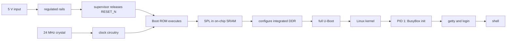
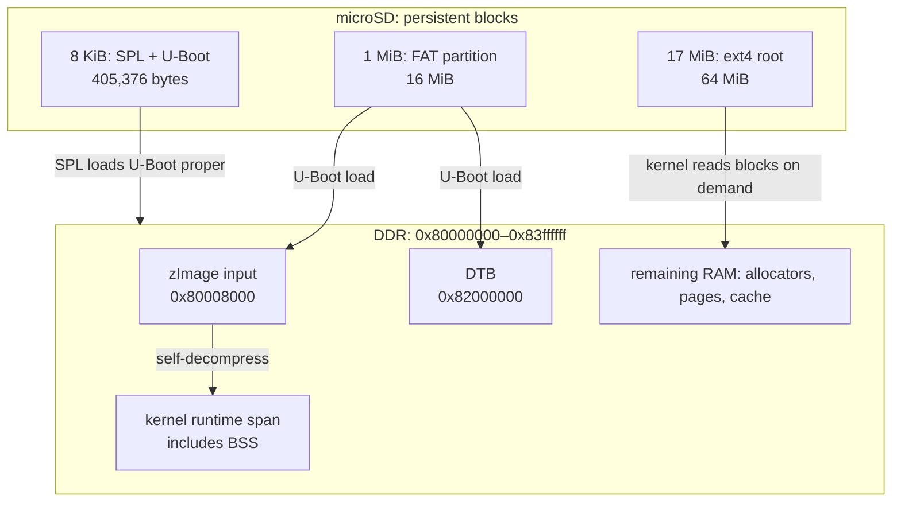

# Embedded Linux from first principles, on the F1C200s Boot Console

An embedded Linux computer is a chain of programs that progressively create the conditions needed by the next program. The Boot Console makes that chain unusually visible: power and a clock let an Allwinner F1C200s execute its immutable ROM; the ROM reads a small loader from microSD; that loader configures the integrated DDR; U-Boot loads Linux and a hardware description; Linux starts one userspace process; that process eventually presents a shell. Nothing in this chain appears by magic, and a failure at any link prevents every later link from existing.

This guide explains that chain using the firmware in this repository. It assumes you can read C and use a shell, but does not assume electronics or kernel experience. It describes an image that has built and passed static validation. No assembled board has booted it yet, so expected observations below are predictions, not reported results. Follow [BRINGUP.md](BRINGUP.md) for the controlled hardware procedure; this guide contains no flashing instructions.

## Before the first instruction

A processor cannot execute code merely because 5 V reaches the board. Transistors need valid supply voltages, sequential logic needs a clock, and the system must remain in reset while those conditions settle.

The Boot Console derives several rails. The F1C200s core uses `+1V1` (nominally 1.1317 V), its integrated DDR uses `+2V5` (2.5561 V) and `DDR_VREF` (1.2780 V), its digital I/O uses the voltage-class net called `+3V3` whose actual nominal value is 3.404878 V, and analog circuitry uses `+2V8_A` (2.800 V). A supervisor watches the rails and holds package pin 70, `RESET_N`, low. Its timing pins are open, selecting a 14–24 ms release delay. A 24 MHz crystal at pins 51 and 52 supplies the reference from which clock circuitry and PLLs derive operating clocks.

These facts explain why “no serial output” is not initially a software diagnosis. Before the UART can transmit one bit, the rails must be in tolerance, the oscillator must run, reset must release, the CPU must fetch an instruction, and the pin multiplexer must connect UART0 to package pins 48 and 49. [The board pinout](../../hardware/docs/PINOUT.md) is the authority for package pin, signal, and schematic-net correspondence.



“Integrated DDR” means the DDR memory and controller are part of the F1C200s package, not that the memory is ready at reset. The controller still needs timings and calibration. The ROM therefore cannot begin by copying a large program into DDR. It first uses storage available before DDR initialization to run U-Boot's Secondary Program Loader, or SPL. SPL is small because its job is narrow: establish enough clocks, pins, and DRAM state to load the larger U-Boot proper.

## What the processor actually does

The ARM926EJ-S core repeatedly fetches an instruction from an address, decodes it, and changes architectural state. That state includes general-purpose registers, a program counter, status registers, and system-control registers. An addition changes a register. A load copies bytes from an addressed location into a register. A store sends bytes from a register to an addressed location. The manufacturer's [F1C200s datasheet](https://linux-sunxi.org/images/5/5e/Allwinner_F1C200s_Datasheet_V1.1.pdf) identifies the ARM9 core, on-chip ROM loader, SIP DDR, USB OTG, UARTs, and package pins used here.

Some addresses refer to RAM. Others refer to peripheral registers. With memory-mapped I/O, storing a bit pattern to a GPIO configuration register changes multiplexers and output drivers rather than preserving ordinary data. Reading a UART status address returns hardware state. A driver is, at bottom, code that performs these reads and writes in the order required by the peripheral, while presenting a stable interface to the rest of the kernel.

Polling a status register wastes CPU time, so peripherals can raise interrupts. An interrupt controller records a request and directs the CPU to an exception handler. The handler acknowledges the device, moves or accounts for data, and wakes code waiting for the event. The UART receive path therefore spans voltage transitions at pin 49, a UART receive register, an interrupt, the serial driver, the kernel TTY layer, and finally bytes returned by `read()` in a process.

Pins are another layer of indirection. F1C200s package pin 59 can act as `PC0`, and this board wires it to `STATUS_LED_N`. The device tree selects its GPIO function. Linux's LED driver owns that GPIO and exposes `/sys/class/leds/boot-console:green:status/`. Calling it “PC0” identifies the SoC port and bit; “pin 59” identifies the physical package ball or lead; `STATUS_LED_N` identifies the schematic net. They are related, but not interchangeable. This guide does not assign a global Linux GPIO number because modern userspace should use the device's subsystem interface and the number is not a physical-pin identity.

The ARM926 has a memory-management unit (MMU), documented in the [ARM926EJ-S technical reference manual](https://documentation-service.arm.com/static/5e8e3d1088295d1e18d3a9b2). Linux programs normally use virtual addresses; page tables translate them to physical addresses and attach permissions. The kernel can isolate processes, map files, and make each process appear to have its own address space. This differs from a common Cortex-M microcontroller setup, where one firmware image executes directly from flash and uses physical SRAM without a process-oriented virtual-memory system. NoMMU Linux exists, so “Linux always requires an MMU” is false. This project runs ordinary MMU-enabled Linux, and that changes both its capabilities and its startup cost.

## Storage is not working memory

The microSD card holds persistent blocks. DDR holds live instructions, stacks, page tables, kernel data, processes, and filesystem cache. The complete `sdcard.img` is 84,934,656 bytes (81 MiB), larger than the board's 64 MiB of RAM. That is fine: the machine never copies the whole disk image into RAM. It reads the bootloader, kernel, DTB, and later individual filesystem blocks as needed.

| Space | Range or location | Size | Purpose |
| --- | --- | ---: | --- |
| SD raw boot area | `[8 KiB, 1 MiB)` | 1016 KiB | SPL plus U-Boot; current binary is 405,376 bytes |
| SD partition 1 | starts at byte 1 MiB | 16 MiB | FAT boot filesystem containing `boot.scr`, `zImage`, and `linux.dtb` |
| SD partition 2 | starts at byte 17 MiB | 64 MiB | ext4 root filesystem |
| Physical DDR | `0x80000000`–`0x83ffffff` | 64 MiB | runtime memory |
| Compressed kernel input | `0x80008000`–`0x804d48c8` (end exclusive) | 5,032,136 bytes | `zImage` as loaded by U-Boot |
| Raw uncompressed `Image` file | build artifact, not loaded by this boot script | 12,159,696 bytes | file bytes before zImage wrapping/compression |
| Kernel runtime span | `0x80008000`–`0x80c40724` (end exclusive) | 12,814,116 bytes | linked text, data, and BSS residency used by validation |
| Device tree | `0x82000000` | 7,428 bytes | hardware description passed to Linux |

The SD address “8 KiB” is a byte offset in a block device. It is not a RAM address. The Boot ROM knows a media-specific convention for finding the SPL there. Once software copies bytes into DDR, hexadecimal CPU addresses describe a different address space.

The kernel example catches a real class of bring-up bug. An earlier boot script placed the DTB at `0x80c00000`. The decompressed kernel's validated runtime range ended at `0x80c40724`, so Linux could overwrite part of the DTB while expanding and zeroing its BSS. The compressed `zImage` file size alone did not reveal the problem: BSS occupies memory at runtime even though it is represented compactly in the file. Moving the DTB to `0x82000000` leaves room within the 64 MiB DDR range.



The table is a physical boot-time view. After the MMU is enabled, kernel and process virtual addresses add another map. A process's address `0x10000` does not imply physical DDR address `0x10000`; page tables decide the translation.

## The bootstrap, one handoff at a time

The immutable Boot ROM is the first software. It runs because reset gives the CPU a defined starting address. It configures only enough hardware to locate a supported boot source, recognizes the Allwinner boot header at the conventional 8 KiB SD offset, and loads SPL into memory usable before DDR. U-Boot's [Allwinner platform documentation](https://docs.u-boot.org/en/v2026.01/board/allwinner/sunxi.html) describes this media convention, while its [SPL overview](https://docs.u-boot.org/en/v2026.01/usage/spl_boot.html) explains the general two-stage loader design.

SPL initializes DDR and loads U-Boot proper from its raw-media location. The combined 405,376-byte file is a packaging unit; the ROM does not copy that entire file into pre-DDR memory. U-Boot is a bootloader and a diagnostic environment, not a small Linux. It has its own drivers, commands, environment, memory allocator, and device-tree handling. A working U-Boot SD command proves U-Boot's SD path; it does not prove the Linux MMC driver works.

U-Boot's distro scan finds and sources `/boot.scr` at the FAT partition root. That generated script comes from the project's [boot command](../board/boot-console/boot.cmd) and says exactly what happens next:

```text
load mmc 0:1 0x82000000 linux.dtb
load mmc 0:1 0x80008000 zImage
bootz 0x80008000 - 0x82000000
```

`mmc 0:1` means MMC device zero, partition one. `bootz` starts an ARM Linux zImage, passes no initramfs (`-`), and supplies the DTB address. The associated command line selects `ttyS0` at 115200 baud, requests early console support, waits for the root device, mounts `/dev/mmcblk0p2` as ext4 read-only, and asks the kernel to reboot five seconds after panic.

The compressed kernel first expands itself, establishes the architecture, enables memory management, initializes interrupt and timer machinery, and probes built-in drivers. The MMC host and ext4 drivers must be built into the kernel because modules stored inside ext4 cannot help the kernel mount that same filesystem. It then mounts the root filesystem and executes its configured init program as process ID 1. PID 1 mounts, starts, and supervises userspace services; the kernel treats init exiting as fatal.

Here PID 1 is BusyBox `init`. The [inittab](../board/boot-console/rootfs-overlay/etc/inittab) mounts filesystems, runs startup scripts, and supervises two terminal sessions. `getty` configures `ttyS0`, displays the login prompt, reads a username, and runs `login`; after authentication, `login` starts the user's shell. The USB terminal uses a wrapper because `/dev/ttyGS0` does not exist until the gadget driver creates it. The wrapper waits and rate-limits retries rather than making PID 1 spin through failed children.

## How one source tree becomes four kinds of software

The build computer and target are different machines. A normal macOS or x86 Linux compiler emits instructions for its own CPU and links against its own operating-system ABI. The Boot Console needs 32-bit ARM926 code and a target C library. A cross compiler runs on the host but emits target instructions. Its sysroot contains the headers and libraries that describe the target ABI.

Buildroot coordinates this. Its own manual describes it as a system that builds a cross toolchain, bootloader, kernel, and root filesystem for a target, and explains that `output/host/` contains host tools plus the target sysroot ([Buildroot manual](https://buildroot.org/downloads/manual/manual.html)). “Host” therefore means the computer performing the build; “target” means the F1C200s board. Some generated programs, such as the device-tree compiler and image-building tools, run on the host. U-Boot, Linux, BusyBox, and target libraries run on ARM.

This repository is a Buildroot external tree. [The defconfig](../configs/boot_console_defconfig) records the small set of intentional choices: ARM926T, Linux, U-Boot, ext4, dynamic `/dev`, a read-only root, and board customization paths. Buildroot expands that into full configurations. The external tree keeps board files separate from the downloaded Buildroot source, which is the upstream-recommended role of `BR2_EXTERNAL` ([Buildroot external-tree documentation](https://buildroot.org/downloads/manual/manual.html#outside-br-custom)).

Configuration layers have different jobs:

- Buildroot Kconfig chooses what to build and how to assemble the system.
- U-Boot Kconfig chooses bootloader features and drivers.
- Linux Kconfig decides which drivers and kernel facilities exist in the binary.
- The device tree describes this board's instantiated hardware and wiring.
- Patches change upstream source where configuration alone cannot express the required behavior.
- The rootfs overlay supplies board-specific files such as `fstab`, `inittab`,
  configfs gadget setup, network services, and the USB getty wrapper.

A device-tree node cannot summon a driver that Kconfig omitted. Conversely, compiling a driver does not prove that hardware exists. For platform devices in this path, Linux populates devices from eligible enabled DT nodes and matches their `compatible` strings against drivers; the kernel documentation describes that `platform_device` to `platform_driver` binding process ([Linux device-tree usage model](https://docs.kernel.org/devicetree/usage-model.html)). Other buses can enumerate children through their own subsystems. Pin control is part of the same contract: enabling UART0 is insufficient unless `pinctrl-0` assigns PE0 and PE1 to UART function.

The F1C200s native USB controller is configured in peripheral role by
`dr_mode = "peripheral"`; the board behaves as a USB device connected to a host,
not as a host for keyboards or flash drives. A startup script uses the kernel's
[configfs gadget interface](https://docs.kernel.org/usb/gadget_configfs.html) to
compose two functions: CDC ACM creates `/dev/ttyGS0`, while CDC ECM creates
`usb0` and a class-compliant Ethernet interface on macOS. The configuration
reports itself as bus-powered with a 500 mA maximum load. That descriptor
informs the host; it neither enforces nor measures current. A terminal may
display 115200 for CDC ACM, but that is line-coding metadata rather than the
physical USB signaling rate; 115200 on UART sets actual bit timing on the wire.

UART remains the first console because U-Boot and Linux can drive it with little initialized state. USB enumeration requires clocks, the PHY, controller, gadget framework, descriptors, cable and host cooperation. Power can also be confusing: a USB-C connector may be involved in powering the board while D+/D− still represent a peripheral connection. UART through a 3.3 V adapter, with the adapter's power lead disconnected, gives the cleanest observation of the whole software chain.

## A write to the LED, end to end

The LED is active-low: current flows from `+3V3` through R31 (1 kΩ), through green LED D3, into PC0, and then to ground when PC0 drives low. R31 limits current. Driving PC0 high removes most of the voltage across that series path, so the LED turns off. The suffix `_N` records that electrical polarity. Yet userspace writes `1` to `brightness` to turn it on. That apparent reversal is deliberate abstraction.

The [board DTS](../board/boot-console/linux.dts) declares a `gpio-leds` child,
names PC0 as `GPIO_ACTIVE_LOW`, and selects the `activity` trigger. During
probing, the GPIO LED driver acquires PC0 with its polarity metadata and
registers an LED-class device. The activity trigger varies the LED with CPU
work; sysfs still lets userspace replace that policy. When a shell redirects `1`
to `brightness`, `write()` enters the kernel, sysfs parses the value, the LED
class invokes the GPIO-backed setter, and the GPIO subsystem converts logical on
to electrical low. The pin controller and GPIO driver finally update MMIO
registers so package pin 59 changes voltage.

```mermaid
sequenceDiagram
    participant Sh as shell
    participant V as VFS/sysfs
    participant L as LED class
    participant G as GPIO driver
    participant P as PC0, package pin 59
    Sh->>V: write "1" to brightness
    V->>L: set logical brightness
    L->>G: set active state
    G->>G: apply active-low polarity
    G->>P: drive STATUS_LED_N low
    Note over P: green LED emits light; no software acknowledgement
```

This is representative of Linux driver design. Userspace asks for a meaningful operation through a subsystem interface. Board description supplies wiring. A reusable controller driver performs the register access. That separation is why the same shell operation can work across unrelated GPIO controllers. The sysfs path resembles an ordinary file, but writing it invokes kernel code; it does not replace persistent bytes in ext4.

The status LED differs from a power LED wired directly to a rail. Its default
activity flicker begins when the kernel's LED trigger runs and reflects time the
CPU spends outside idle. It is evidence of processor activity, not proof that
userspace is healthy. Likewise, a successful sysfs `write()` proves that the
kernel accepted the request; only observing D3 proves that the driver, pinmux,
PC0 electrical state, resistor, LED orientation, and board wiring agree.

## Which file do I edit?

Once the layers are clear, most firmware changes have a specific home.

| Desired change | Edit | Reason |
| --- | --- | --- |
| Describe board wiring, enable a peripheral, select pins, or set GPIO polarity | [`board/boot-console/linux.dts`](../board/boot-console/linux.dts) | The DT records instantiated hardware and connections. |
| Compile another Linux driver or kernel facility | [`board/boot-console/linux.fragment`](../board/boot-console/linux.fragment) | Kconfig controls what code exists in the kernel. Enabling only the DT node cannot supply a missing driver. |
| Change login consoles or process supervision | [`rootfs-overlay/etc/inittab`](../board/boot-console/rootfs-overlay/etc/inittab) | BusyBox init reads this at runtime. |
| Add startup files or board-specific userspace configuration | [`rootfs-overlay/`](../board/boot-console/rootfs-overlay/) | Buildroot copies this directory into the generated root filesystem. It is unrelated to Linux OverlayFS. |
| Add target packages or change rootfs/toolchain policy | [`configs/boot_console_defconfig`](../configs/boot_console_defconfig) | Buildroot resolves these selections into the complete system configuration. |
| Change kernel load addresses or boot arguments | [`board/boot-console/boot.cmd`](../board/boot-console/boot.cmd) | U-Boot sources the compiled script before launching Linux. Recheck all runtime memory ranges after moving anything. |
| Change SD partition sizes, order, or raw U-Boot placement | [`board/boot-console/genimage.cfg`](../board/boot-console/genimage.cfg) | Genimage constructs the final block layout. Keep boot arguments and partition numbering consistent. |
| Change a physical rail voltage | board schematic and power components | Resistor dividers and regulators set the rail. The DTS fixed-regulator value describes the measured design contract to software; it cannot command these fixed supplies to change voltage. |

After changing the DTS, fragments, patches, or boot script, use the repository's documented `./build-container.sh rebuild-board` path and then `./build-container.sh validate`. A defconfig change requires the clean-build path described in the [firmware README](../README.md). These checks remain artifact checks until an assembled board supplies electrical and boot evidence.

## The root filesystem is policy as well as files

The root ext4 filesystem contains BusyBox, configuration, libraries, and
device-support files. BusyBox places many commands behind one executable, which
reduces storage and dependency cost. This image adds only enough networking for
the direct ECM link, Dropbear SSH, and BusyBox HTTP/DHCP services; it still has
no Python or package manager. Experiments below use only tools configured for
this target.

The root is mounted read-only to make unexpected writes and corruption less likely. Runtime state still needs writable space, so [fstab](../board/boot-console/rootfs-overlay/etc/fstab) mounts `tmpfs` at `/run`, `/tmp`, and `/var`. tmpfs consumes memory and disappears at reboot. `/proc` is a kernel-generated view of processes and kernel state; `/sys` exports kernel objects and controls; `/dev` contains device nodes backed by devtmpfs. These paths look like ordinary directories, but their contents come from kernel filesystems rather than persistent ext4 blocks.

This policy has operational consequences. A file created in `/tmp` can prove RAM-backed filesystem writes work, but it does not prove the SD root is writable. Logs under `/var` disappear after power loss. Updating a persistent configuration requires producing and deploying a new image or deliberately remounting in a controlled development procedure.

## Debug from the last stage that definitely worked

Boot failures are easier when treated as chain breaks. Do not begin by changing several layers. Preserve the complete UART capture, name the last milestone, and test the immediately adjacent assumptions.

| Last reliable observation | The next boundary to investigate |
| --- | --- |
| No UART characters | input power, rails, oscillator, reset, ROM SD access, UART wiring, baud |
| SPL banner only | integrated DDR controller setup and U-Boot loading |
| U-Boot prompt | FAT files, load results, addresses, DTB, `bootz` arguments |
| Linux banner or early console | kernel setup, DT correctness, selected console |
| root-mount panic | MMC Linux driver, partition 2, ext4 support, `rootwait` |
| init starts but no login | `inittab`, device node, getty, login configuration |
| UART login works; USB does not | USB PHY/controller, gadget driver, descriptors, cable, host enumeration |
| shell works; LED does not | LED DT node, pinmux, polarity, wiring |

The distinction between U-Boot and Linux drivers matters here. Likewise, a compiled DTB proves syntax and internal consistency, but not that the schematic matches it. Voltage and scope measurements resolve electrical claims; UART logs resolve stage transitions; kernel state resolves driver binding.

## Guided experiments

These experiments inspect artifacts or a board already booted according to [BRINGUP.md](BRINGUP.md). `HOST` means the development computer. `U-BOOT` means its interactive prompt. `TARGET` means the BusyBox shell. Expected observations are conceptual and must be replaced by captured evidence during hardware validation.

### 1. Distinguish image size from RAM size

```sh
# HOST — from my-first-linux-board/firmware
stat -f '%N %z bytes' output/images/sdcard.img output/images/zImage output/images/linux.dtb
```

On GNU systems, use `stat -c '%n %s bytes' ...` instead. Expect the disk image to exceed 64 MiB while zImage and DTB are much smaller. The observation is that storage capacity is not allocated wholesale in DDR.

### 2. Inspect the configured U-Boot entry path

```text
# U-BOOT — interrupt autoboot, then inspect without changing state
printenv bootcmd
fatls mmc 0:1
```

The resolved configuration sets `bootcmd` to `run distro_bootcmd`, and includes the FAT command. Expect `fatls` to list `boot.scr`, `zImage`, and `linux.dtb`; real console output remains hardware evidence to collect. Reading those names proves U-Boot's MMC and FAT paths work, but says nothing about Linux's MMC driver. The expected next path is a distro scan finding `/boot.scr` on `mmc 0:1`. The script then sets `bootargs` and immediately runs `bootz`, so inspecting `bootargs` before sourcing it would teach the wrong lesson. Its build-time source of truth is `boot.cmd`.

### 3. Ask Linux what it was told and what it mapped

```sh
# TARGET
cat /proc/cmdline
cat /proc/meminfo
mount
```

Expect the command line to agree with U-Boot, available memory to be less than 64 MiB because the kernel reserves and occupies pages, `/` to be read-only ext4, and `/run`, `/tmp`, and `/var` to be tmpfs. This connects boot arguments to live kernel policy.

### 4. Observe volatile storage safely

```sh
# TARGET
echo volatile > /tmp/storage-test
cat /tmp/storage-test
mount
```

Expect the value to read back while powered. `/tmp` is tmpfs, so this changes RAM only. After a normal reboot, the file should be absent; confirm that only when the board bring-up procedure has reached repeatable power cycling.

### 5. Follow the LED abstraction

```sh
# TARGET
cat /sys/class/leds/boot-console:green:status/trigger
echo none > /sys/class/leds/boot-console:green:status/trigger
echo 1 > /sys/class/leds/boot-console:green:status/brightness
echo 0 > /sys/class/leds/boot-console:green:status/brightness
```

Expect the trigger list to mark `activity` before it is disabled. Logical `1`
should illuminate the active-low LED and `0` should extinguish it. If the files
exist but light does not change, Linux binding succeeded and the investigation
moves toward GPIO state and physical polarity.

### 6. Separate UART from USB readiness

```sh
# TARGET, reached over UART
ls -l /dev/ttyS0 /dev/ttyGS0
ifconfig usb0
dmesg
```

The UART console is usable during early boot, before devtmpfs creates
`/dev/ttyS0`; by the target-shell stage its device node should exist. The gadget
TTY and Ethernet interface may appear later because their driver stack must
initialize. Use the host operating system's normal USB-device inspection after
connecting the native USB port; do not expect `lsusb` on this tiny target. The
conceptual result is two terminal paths with different initialization
dependencies, plus a network link that exists only after the composite gadget
and host ECM driver are ready. From the host, `http://192.168.7.2/` shows the
live status page and `ssh root@192.168.7.2` reaches the same target shell.

## What the successful build proves

The pinned project selects Buildroot 2026.02.2, U-Boot 2026.01, and Linux 6.19.14; [SOURCES.md](../SOURCES.md) records archive hashes and provenance. `BR2_REPRODUCIBLE=y` removes or normalizes some sources of build variation, and the external tree captures configuration, patches, boot script, root overlay, and image layout. This makes the build reviewable and repeatable in a bounded environment.

It does not yet demonstrate bit-for-bit equality across two independent clean builds. The Docker base is digest-pinned, but package-manager package versions inside that base are not all locked to immutable artifacts. A successful build and `validate_artifacts.py` prove that selected sources compile and that generated configurations, DTB properties, image partitions, sizes, and memory ranges satisfy encoded invariants. They cannot prove DDR timing, signal integrity, UART voltage levels, USB enumeration, oscillator startup, or LED polarity on copper.

The first board boot will produce the missing evidence. Preserve its power measurements and full UART log, identify the last completed boundary, and change one adjacent assumption at a time. Doing that turns the boot chain from a black box into a sequence of testable contracts.
